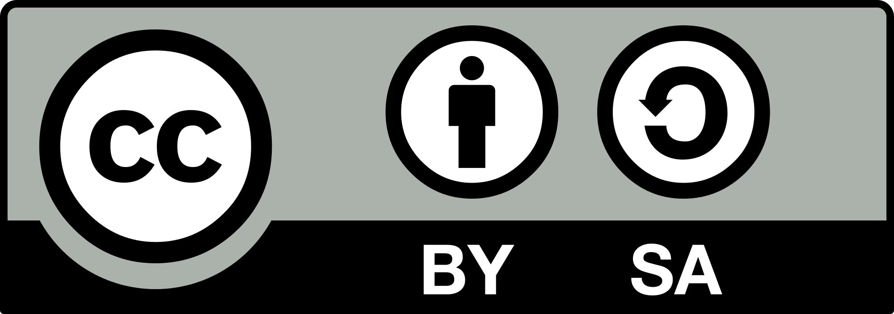

# Evaluación CDD

Aplicación práctica para evaluar el Área 2 del Marco de Referencia de la Competencia Digital Docente (MRCDD).

## Documentación

Toda la información sobre la aplicación, las pruebas y su uso está disponible en:

### [Abrir la documentación de Evaluación CDD](https://gonvga.github.io/tfm-cdd-evaluacion/)

## Descargar para Windows

[Descargar la versión portable más reciente](https://github.com/gonvga/tfm-cdd-evaluacion/releases/latest/download/EvaluacionCDD-portable-windows.zip)

No requiere instalación ni Python. Descomprime el ZIP y ejecuta `EvaluacionCDD-portable.exe`.

## Licencia

Esta obra se distribuye bajo una licencia [Creative Commons Atribución-CompartirIgual 4.0 Internacional (CC BY-SA 4.0)](https://creativecommons.org/licenses/by-sa/4.0/deed.es).
